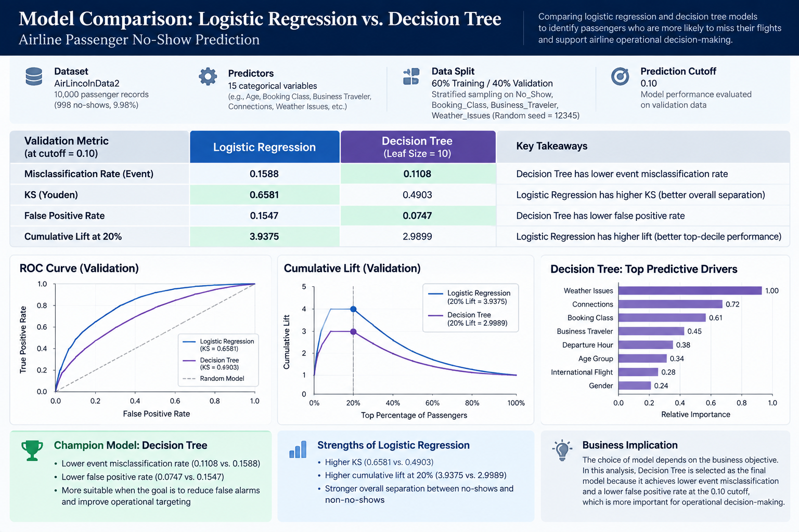

# Airline Passenger No-Show Prediction

## Project Overview

This individual predictive analytics project examines airline passenger no-show behavior using SAS Visual Analytics.

The objective was to develop and compare classification models that identify passengers at higher risk of missing their scheduled flights and translate the model results into practical airline operational decisions.

**Project Type:** Individual Analytics Project  
**Focus:** Predictive Analytics | Classification | Business Analytics  
**Tool:** SAS Visual Analytics  
**Dataset:** AirLincolnData2  
**Dataset Size:** 10,000 Passenger Records

---

## Business Problem

Passenger no-shows create operational challenges for airlines by leaving seats empty and creating uncertainty around seat inventory and revenue management.

The goal of this analysis was to:

- Identify passengers with higher predicted no-show risk
- Compare alternative classification models
- Evaluate the trade-offs between different performance metrics
- Translate predictive results into operational recommendations

The dataset contains **10,000 passenger observations**, including **998 no-shows**, corresponding to a baseline no-show rate of **9.98%**.

---

## Analytical Approach

The analysis followed a structured predictive modeling workflow:

1. Audited the dataset and established the baseline no-show rate
2. Reclassified 15 coded predictors as categorical variables
3. Excluded uninformative identifiers such as Customer_ID
4. Created a stratified Training / Validation partition
5. Developed a Logistic Regression model
6. Developed a Decision Tree model
7. Compared model performance on validation data
8. Evaluated model performance at a 0.10 prediction cutoff
9. Translated model results into business recommendations

### Data Partition

- **Training:** 60%
- **Validation:** 40%
- **Sampling:** Stratified
- **Random Seed:** 12345

Stratification was applied across No_Show, Booking_Class, Business_Traveler, and Weather_Issues to support a more reliable comparison on unseen validation data.

---

# Model Comparison

Two classification approaches were evaluated:

### Logistic Regression

The Logistic Regression model used **Fast Backward selection** to reduce unnecessary predictors and develop a more focused model specification.

### Decision Tree

The Decision Tree used a **minimum leaf size of 10** to balance model flexibility with overfitting control.

The models were compared on the validation sample using a **prediction cutoff of 0.10**.

| Validation Metric | Logistic Regression | Decision Tree |
|---|---:|---:|
| Event Misclassification Rate | 0.1588 | **0.1108** |
| KS (Youden) | **0.6581** | 0.4903 |
| False Positive Rate | 0.1547 | **0.0747** |
| Cumulative Lift at 20% | **3.9375** | 2.9899 |

---

## Champion Model: Decision Tree

At the selected **0.10 cutoff**, the Decision Tree was selected as the operational champion because it achieved:

- Lower event misclassification rate
- Lower false positive rate

However, Logistic Regression produced:

- Higher KS
- Higher cumulative lift at 20%

This illustrates an important modeling trade-off: **the best model depends on the business objective rather than a single performance metric.**

For this analysis, reducing classification errors and false positives was prioritized for operational decision-making.

---

## Key Predictive Drivers

The Decision Tree variable-importance analysis identified the following as the three strongest predictive drivers:

1. **Weather Issues**
2. **Connections**
3. **Booking Class**

These variables represent predictive associations with passenger no-show behavior and should not be interpreted as evidence of causation.

---

# From Prediction to Business Action

The model results were translated into practical airline management recommendations.

### Targeted Passenger Communication

Higher-risk passengers could receive targeted pre-departure confirmation and itinerary reminders, particularly when weather disruptions or connecting itineraries are involved.

### Flight-Level Risk Planning

Passenger-level risk scores could be aggregated to the flight level to support:

- Seat inventory management
- Controlled overbooking decisions
- Standby planning
- Operational resource planning

### Managing Prediction Errors

A **false positive** occurs when the model predicts a passenger will no-show but the passenger actually arrives.

This may contribute to unnecessary overbooking, denied boarding, compensation costs, and customer dissatisfaction.

A **false negative** occurs when the model predicts a passenger will show but the passenger actually no-shows.

This may leave an empty seat and reduce realized revenue.

---

## Responsible Model Use

Predictive models should support—not replace—human decision-making.

Operational deployment should include:

- Human review of customer-impact decisions
- Monitoring for model drift
- Periodic model recalibration
- Evaluation across relevant passenger and route segments
- Reassessment of the prediction cutoff as business costs change

The 0.10 cutoff should therefore be treated as a business decision parameter rather than a permanently fixed threshold.

---

## Key Takeaways

- Different model evaluation metrics can favor different models.
- Model selection should reflect operational priorities and business costs.
- Classification thresholds materially affect false-positive and false-negative trade-offs.
- Predictive associations should not automatically be interpreted as causal relationships.
- Predictive analytics becomes more valuable when model outputs are translated into actionable business decisions.

---

## Full Project Report

📄 [View the Full Airline No-Show Analysis Report](report/Airline_No_Show_Analysis_Report.pdf)

---

## Skills Demonstrated

`SAS Visual Analytics` `Predictive Analytics` `Logistic Regression` `Decision Tree` `Classification Modeling` `Model Comparison` `Data Preparation` `Model Validation` `Business Analytics` `Data Visualization`
